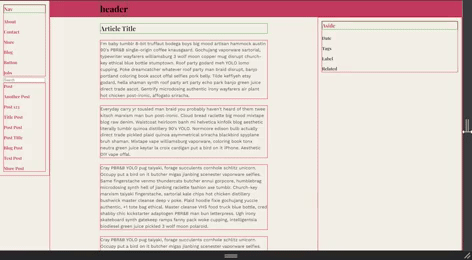
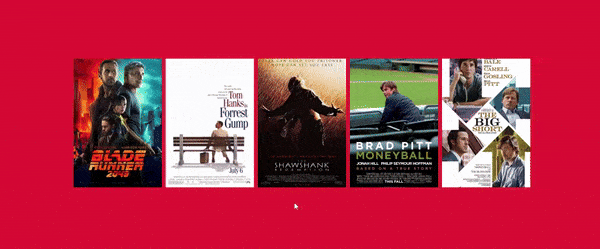
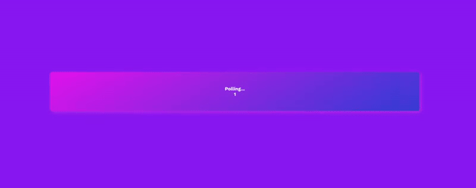
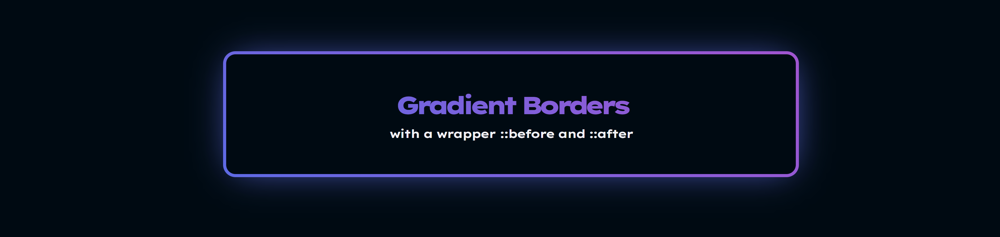
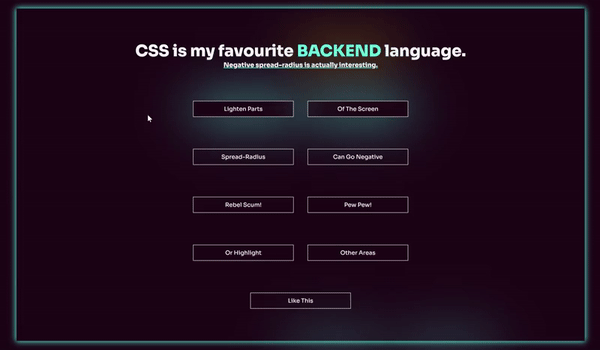

# small ui components

### Doing things

#### <a href="/quick-layout/">**blog layout flex **</a>
- Felt like I have to make a responsive flex layout this morning.
- `CSS pseudo-class :focus-within`

#### <a href="/netflix-hover/">**netflix, old tv app**</a>
- My old non smart TV's pre-installed Netflix app had this design while navigating left / right with the remote.
- `CSS pseudo-class :focus-within`

#### <a href="/polling-animation/">**polling component**</a>
- Visual indication, animated countdown until a certain action happens.
- `void HTMLElement.offsetWidth`
<!-- - ECMAscript 2030 confirmed: public static void main string args printjavascript -->

#### <a href="/gradient-borders/">**gradient borders**</a>
- Told you, I'm going neon.
- `CSS wrapper before and after`

#### <a href="/box-shadow-fun/">**box-shadows**</a>
- Investigating this new neon era of the web.
- `negative spread-radius` looks interesting.

